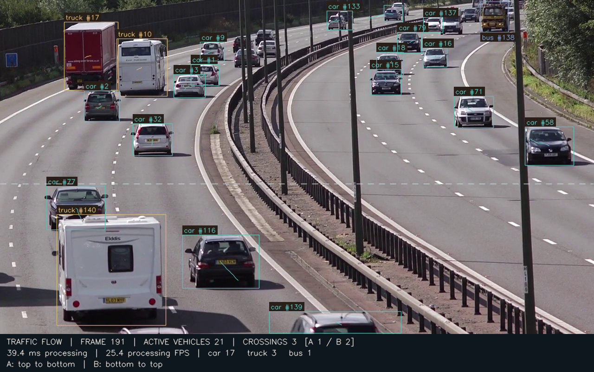
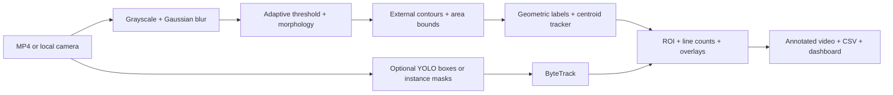
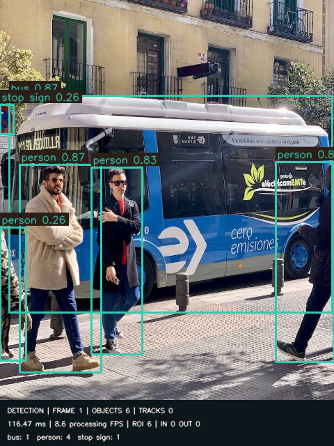
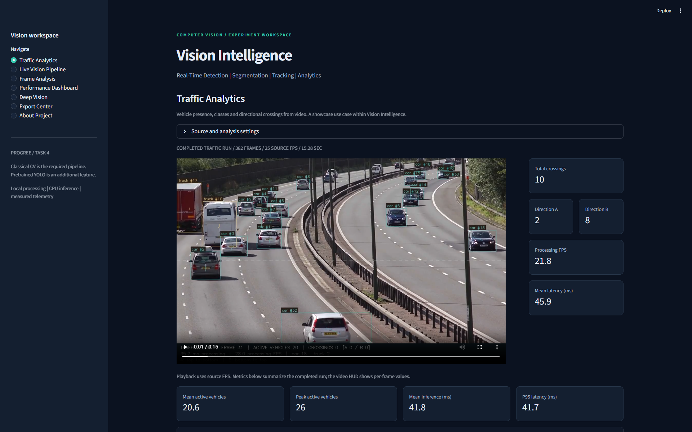

# Vision Intelligence

**Turning traffic footage into vehicle-flow analytics.**

**Try the live app:** [vision-intelligence-fayz.streamlit.app](https://vision-intelligence-fayz.streamlit.app/)

Visitors can upload a clean traffic MP4 up to **50 MB and 30 seconds** and run CPU-based YOLOv8n vehicle detection, ByteTrack tracking and directional counting on the public Streamlit deployment.

Traffic cameras generate hours of video, but extracting vehicle classes, visible counts and movement by hand is slow. Vision Intelligence converts video into tracked detections, directional crossing events and frame-level telemetry, with annotated video and CSV exports.

**Python · OpenCV · YOLOv8 / instance segmentation · ByteTrack · Streamlit**



[Watch the 28-second showcase](docs/linkedin/linkedin_demo.mp4) · [Traffic results](report/Traffic_Demonstration.md) · [Six-page whitepaper](report/Task_4_Whitepaper.pdf)

On the supplied **15.28-second traffic clip**, the CPU run processed **382 frames**, recorded **10 crossings (A: 2 / B: 8)** and measured **21.77 processing FPS**. This is throughput with documented exclusions, not accuracy or end-to-end deployment speed.

Traffic Analytics is the flagship **showcase use case** within a general vision project. The original classical pipeline and inspector remain intact. Built by **Fayz Liaqat** for **Progree Artificial Intelligence Internship, Task 4**.

## What it does

- **Traffic Analytics:** vehicle-only inference, active counts, horizontal/vertical Direction A/B crossings, short trails and timestamped event CSVs.
- **Classical vision:** configurable Gaussian/adaptive stages, morphology, area bounds and geometric Circle / Rectangle / Triangle / Other labels.
- **Tracking and counting:** from-scratch centroid association, 24-point trails, ROI class counts and one-crossing-per-ID counting with a deadband.
- **Deep vision:** optional YOLOv8n detection and YOLOv8n-seg instance masks; ByteTrack IDs for videos. Missing dependencies or weights leave classical processing operational.
- **Inspection:** seven saved stages, representative frames without reprocessing, actual latency/FPS/count charts and an export center.
- **Reproducibility:** seeded video, ground truth, two executed notebooks, focused tests and saved configuration/environment metadata.

## Architecture




The threshold mask can have hollow interiors. External contours recover enclosed boundaries; this is **contour segmentation**, not semantic segmentation. Standard YOLO detection returns boxes. Only the segmentation checkpoint returns instance masks.


## Official requirements and additions

<!-- REQUIREMENTS_START -->
| Official requirement | Implementation and evidence |
|---|---|
| Real-time CV pipeline | FrameProcessor; optional realtime_demo.py camera preview |
| Gaussian filtering | cv2.GaussianBlur; blurred PNGs and notebook 1 |
| Adaptive threshold matrices | cv2.adaptiveThreshold; Gaussian / Mean controls |
| Shape extraction by pixel bounds | External contours; min/max contour area |
| Dynamic target count overlays | Per-class counters and cv2.putText HUD |
| Frame-by-frame inference metrics | frame_metrics.csv: one measured row per frame |
| Performance whitepaper | Six-page PDF and Task_4_Whitepaper.md |
<!-- REQUIREMENTS_END -->

Additional engineering includes deterministic ground truth, geometric tracking IDs, trails, ROI and crossing counts, dashboard controls, frame inspection, H.264 export, ByteTrack and pretrained instance segmentation. No model training, database or API server was added.

## Controlled synthetic evaluation

A complete synthetic run: **240 frames · 960 x 540 · 30 source FPS · 8 seconds · seed 42**. Mild noise, three persistent shapes and a smaller circle visible on frames 46-190. Separate lanes avoid occlusion.

<!-- RESULTS_START -->
| Metric | Measured value |
|---|---|
| Processed / source frames | 240 / 240 |
| Mean / median processing latency | 19.187 / 19.003 ms |
| P95 / maximum latency | 22.749 / 24.355 ms |
| Mean per-frame FPS | 52.742 |
| Aggregate processing FPS | 52.118 |
| Mean / maximum objects | 3.6042 / 4 |
| Unique tracked IDs | 4 |
| Entered / exited (once per ID) | 2 / 2 |
<!-- RESULTS_END -->

These measurements come from [frame_metrics.csv](outputs/frame_metrics.csv) and [run.json](outputs/run.json). Latency includes processing, association, analytics and geometric overlays; it excludes source decoding, HUD text, encoding, disk I/O and model load. Aggregate processing FPS is `1000 / mean_latency_ms`; mean per-frame FPS is reported separately. Neither is a claim of end-to-end webcam throughput. Results vary with machine load.


**Controlled correctness:** 865 matched object-frame instances, zero unmatched predictions, zero misses, zero count MAE and zero matched ID changes. Matching is one-to-one within 20 pixels. Shape labels were correct on all matches. This easy benchmark does **not** establish real-world accuracy, mAP or robust occlusion handling. See [synthetic_evaluation.json](outputs/synthetic_evaluation.json) for definitions.

## Pretrained vision: detection and instance segmentation

Both models now run on the supplied traffic footage; [traffic evidence](report/Traffic_Demonstration.md) is separate from synthetic evaluation. The original integration smoke tests below are retained.

Both models ran on the attributed Ultralytics bus image and a 20-frame translated-photo clip. Detection returned real boxes; segmentation returned six instance masks on the still image. Both video exports were read back successfully with persistent IDs. This verifies integration, not natural-motion tracking quality. First-inference startup remains in the CSV. No speed ranking is made against the differently sized classical benchmark.

| Detection | Instance segmentation |
|---|---|
|  |  |

See [YOLO verification](outputs/yolo_verification.json) and [attribution](THIRD_PARTY_NOTICES.md). Model weights are downloaded on first use and excluded from Git.

## Install and run

Python **3.13** was tested on Windows. The main requirements include the optional YOLO stack for the live cloud app. Create an isolated environment in this repository:

```powershell
python -m venv .venv
.\.venv\Scripts\Activate.ps1
python -m pip install -r requirements.txt
python -m streamlit run app.py
```

On macOS/Linux activate with `source .venv/bin/activate`. Install [FFmpeg](https://ffmpeg.org/download.html) and put `ffmpeg` on PATH for browser-compatible H.264. Without it, OpenCV exports mp4v, which some browsers cannot play; downloads and frame images remain usable.

To install only the lightweight classical app and core test dependencies:

```powershell
python -m pip install -r requirements-core.txt
```

On first use, YOLO downloads its pretrained weights; weights are not stored in Git. Inference uses CPU. Traffic Analytics accepts MP4 uploads up to 50 MB and 30 seconds on the public demo. Deep Vision supports its existing detection and instance segmentation workflows. COCO classes do not include abstract benchmark shapes; use real-world media.

## Reproduce the evidence

```powershell
python benchmark.py
python -m pip install -r requirements-dev.txt
python -m unittest discover -s tests -v
python -m ruff check . --select E9,F
python -m jupyter notebook notebooks
python scripts/verify_yolo.py
python scripts/build_report.py
```

Run notebook 1 top to bottom for the classical stages. Notebook 2 processes the whole sample and regenerates canonical metrics and charts; both already contain saved outputs. Rebuild the report afterward so tables match the current run. `scripts/verify_yolo.py` retrieves the attributed source image if missing, downloads weights if needed and executes both deep modes.

For a local webcam:

```powershell
python realtime_demo.py --camera 0
```

Press **q** to exit. An unavailable camera prints an actionable message and exits with code 1. Physical-camera behavior must be verified with your hardware and permissions.

## Dashboard workflow

1. Start in **Traffic Analytics** to play the measured showcase or process clean traffic footage. Use **Load saved traffic showcase** to return to canonical evidence.
2. In **Live Vision Pipeline**, use the demo or upload MP4, adjust parameters and select **Process video**.
3. **Frame Analysis** inspects early, middle and later saved frames without rerunning inference.
4. **Performance Dashboard** shows real telemetry and the saved configuration.
5. **Deep Vision** runs pretrained boxes or instance masks on a real-world image/video.
6. **Export Center** downloads videos, CSVs and charts.

Each interactive run uses `outputs/runs/<generated-id>/`. Uploaded names cannot choose arbitrary paths. These local runs are ignored by Git and persist until removed. Exported videos do not retain audio.



## Project structure

```text
app.py                         Streamlit workspace
benchmark.py                   Synthetic run + quality evaluation
generate_demo.py               Seeded video + ground truth
realtime_demo.py                Optional local camera
src/
  preprocessing.py             Gray, Gaussian, threshold, morphology
  segmentation.py              Contours, bounds, geometric labels
  tracking.py                  Centroid matching and scene analytics
  yolo_detector.py             Lazy optional models + ByteTrack
  video_processor.py           Shared engine, overlays, video I/O
  metrics.py                   Statistics and figures
  traffic.py                   Vehicle metrics and compact traffic overlays
  traffic_page.py              Traffic Analytics preset and event audit
notebooks/                     Two executed instructional notebooks
data/                          Sample MP4, truth, attributed deep sample
outputs/                       CSVs, videos, frames, charts and metadata
report/                        Six-page PDF and Markdown whitepaper
docs/demo/                     Actual app screenshots and showcase figures
docs/linkedin/                 28-second video, caption, edit script, checklist
scripts/                       Deep verification, report and local video builders
tests/                         Pipeline and Streamlit AppTest coverage
```

[Exact artifact inventory](docs/ARTIFACTS.md) · [Verification record](docs/VERIFICATION.md)

## Limitations worth understanding

- Dark foreground on a bright background is the classical default. Texture, scale and overlapping contours require retuning.
- Greedy association can switch IDs. Unique IDs need not equal unique physical objects.
- A line counts **once per track ID per run**. Traffic uses Direction A/B: horizontal means top-to-bottom / bottom-to-top; vertical means left-to-right / right-to-left. Legacy classical CSVs retain entered/exited fields.
- ROI uses centroid inclusion, not mask overlap. Full-frame detection remains active.
- Synthetic quality is not semantic segmentation accuracy or natural-scene accuracy.
- UI processing is batch-on-demand. The public traffic demo limits uploads to 50 MB and 30 seconds; this is a short-clip showcase, not production-scale processing. Camera processing is a separate local script; there is no browser webcam streaming or cancellation.
- Other upload pages follow the Streamlit app's 100 MB upload setting. Large videos can still take substantial time and local storage.
- CPU model startup can be slow. No GPU performance was measured.

## Core CI and verification

[Core checks](.github/workflows/core-tests.yml) install only `requirements-core.txt`, compile Python, run Ruff E9/F and execute unit/AppTest coverage. They do not install Ultralytics or download weights; model integration is verified locally. See [verification](docs/VERIFICATION.md).

No project software license has been selected. The owner can choose one separately; media permission is documented in THIRD_PARTY_NOTICES.md.

## Demo recording

See [docs/demo/README.md](docs/demo/README.md) for a short recording sequence. Screenshots come from the actual application. Nothing has been posted to LinkedIn.

## References and attribution

[OpenCV thresholding](https://docs.opencv.org/4.x/d7/d4d/tutorial_py_thresholding.html) · [Ultralytics tracking](https://docs.ultralytics.com/modes/track/) · [YOLOv8 models](https://docs.ultralytics.com/models/yolov8/)

See [THIRD_PARTY_NOTICES.md](THIRD_PARTY_NOTICES.md) for pretrained software and sample-media provenance.
