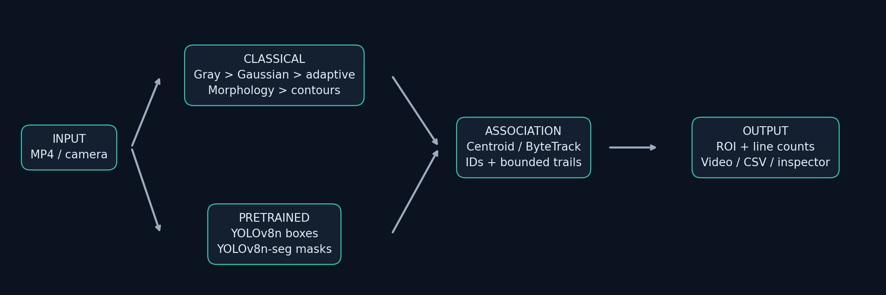
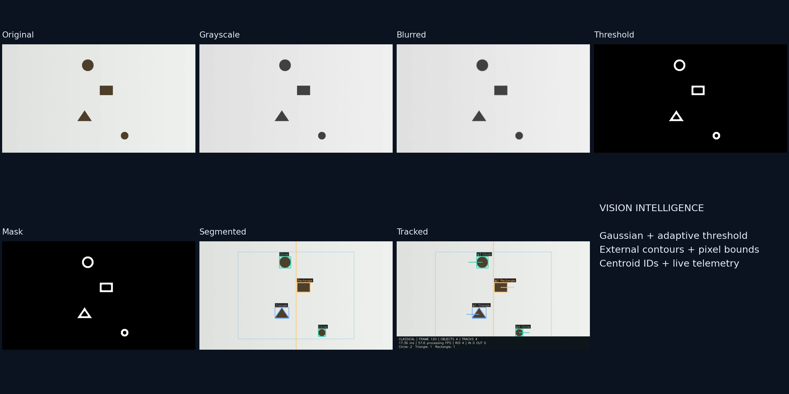
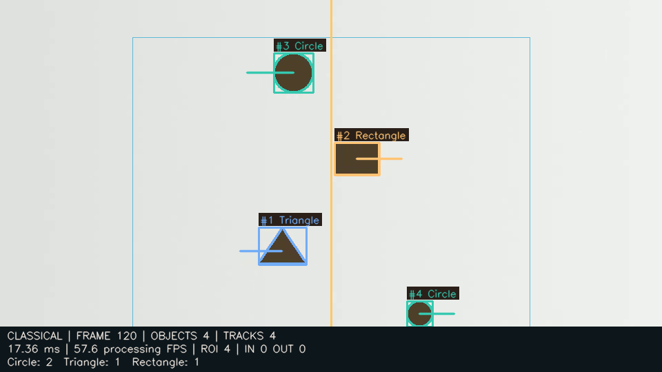
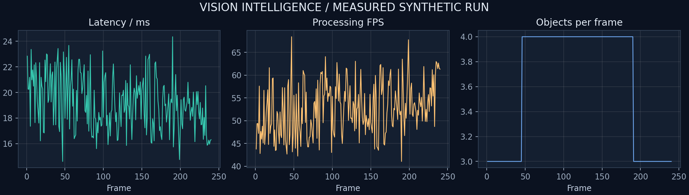
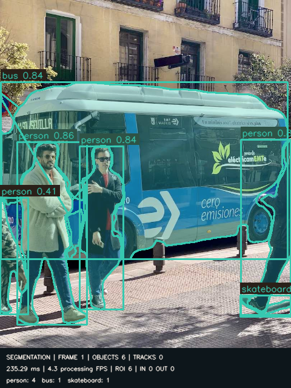

# Vision Intelligence

A Real-Time Multi-Object Detection, Segmentation, Tracking and Performance Analytics Engine

Fayz Liaqat | Progree Artificial Intelligence Internship | Task 4 | September 2026

## Executive summary

This project implements the required OpenCV contour pipeline and a separate pretrained deep-vision extension. The classical path combines Gaussian filtering, adaptive thresholding, morphological cleanup, area-bounded contour extraction, geometric classification and a centroid tracker written from scratch. Streamlit exposes parameters, saved stages, telemetry and exports. The complete synthetic run processed 240 frames at 960 x 540 pixels. Mean processing latency was 19.187 ms; aggregate processing throughput was 52.12 FPS on this machine. These are processing measurements, not a claim of end-to-end camera or deployment speed.

## Problem statement and scope

The official task asks for a video pipeline that extracts and tracks target contours, applies Gaussian filters and adaptive threshold matrices, overlays dynamic target counts, evaluates every frame, and documents the results. The practical engineering challenge is to connect these stages while preserving correspondence between visual evidence, tracking IDs and numerical results. A plausible overlay alone does not prove correct counting or runtime measurement.

The implementation keeps processing logic independent of the interface. A deterministic generator supplies known object centers and classes. Both notebooks call the same modules as the app and camera entry point. The benchmark produces its own video, CSVs, stage figures and quality measurements. No detector was trained, no accuracy result was inferred from unlabeled footage, and no production-scale deployment is claimed.

Figure 1. Two complementary vision paths share annotation, telemetry and artifact export. The classical path is the mandatory internship pipeline.

## Architecture and responsibilities

Small modules separate preprocessing, segmentation, tracking, optional pretrained inference, video orchestration and metrics. The application performs batch processing on demand; the optional camera script processes consecutive frames as they arrive. Frame selection reads saved images without repeating inference. This separation keeps the official pipeline easy to inspect and explain in an interview.

<!-- page break -->

# The required classical pipeline

## From pixels to candidate shapes

Each decoded BGR frame is converted to grayscale. A 5 x 5 Gaussian filter with OpenCV-selected sigma suppresses high-frequency noise before thresholding. The app permits 3, 5 or 7 pixel kernels: increasing blur can remove noise but also smooth small corners and merge nearby boundaries. Gaussian filtering is performed on every processed frame, not only in a demonstration cell.

Adaptive Gaussian thresholding uses a 31 x 31 local neighborhood and C=7. OpenCV subtracts C from the weighted neighborhood mean and applies inverse binary thresholding, selecting sufficiently dark pixels. Adaptive Mean is also exposed. Block size must be an odd integer at least 3. Local thresholds accommodate mild illumination variation, but texture can generate unwanted contours. Dark objects on a light background are an explicit default assumption.

A 3 x 3 closing operation bridges small gaps, followed by opening to suppress isolated noise. Cleanup is configurable and can be disabled; it does not replace thresholding. The saved mask can contain boundary bands with hollow interiors. External contours recover enclosed boundaries; area filtering retains contours between 250 and 20,000 square pixels. This is contour segmentation, not a dense semantic mask.

Figure 2. Actual frame 120: original, grayscale, Gaussian blur, adaptive threshold, cleaned mask, contour overlay and tracked output.

## Geometry and pixel bounds

For each contour, the code computes area, closed perimeter, bounding rectangle and image moments. The centroid is (m10/m00, m01/m00); zero-area contours are rejected. Polygon approximation uses 2.5% of perimeter: three vertices indicate Triangle, four indicate Rectangle, and at least six plus circularity 4*pi*A/P^2 >= 0.76 indicate Circle. Remaining contours are Other. These are geometric labels, not general-purpose semantic classes.

<!-- page break -->

# Tracking, counting and frame analytics

## Centroid association from scratch

The tracker enumerates Euclidean distances between retained track centroids and current detections, sorts candidate pairs, and accepts a pair only if neither member has been used. The default maximum distance is 55 pixels. Unmatched detections receive monotonically increasing integer IDs. Unmatched tracks accumulate missed frames and expire after more than 10 misses. A track can reconnect within that window near its last observed location.

This is transparent greedy assignment, not a Kalman filter, global Hungarian assignment or appearance tracker. Fast motion, occlusion, intersecting trajectories and camera movement can cause identity swaps. Active tracks counts IDs observed in the current frame, excluding retained missing tracks. Unique tracks counts assigned IDs across the run and can exceed the number of physical objects.

## ROI, movement trails and line crossing

Each visible track keeps at most 24 recent coordinates. Analytics histories expire after 30 unseen frames. The ROI uses normalized numeric bounds and counts detections with centroids inside it. Full-frame processing remains active, so total and ROI counts are comparable. The benchmark ROI spans x=0.2-0.8 and y=0.1-0.9; it does not crop the input.

A vertical line at x=0.5 counts left-to-right as Entered and right-to-left as Exited. A four-pixel deadband ignores uncertain positions near the line. Each ID is counted at most once per run, even if it moves back. These are image-plane directions, not a calibrated physical entrance. Fragmented IDs can still overcount a physical object; that limitation is disclosed.

Figure 3. Actual tracked frame with IDs, geometric labels, ROI, line, bounded trails and telemetry footer.

The HUD reports mode, frame, objects, currently visible tracks, processing latency, processing FPS, ROI count, entered/exited totals and class counts. Counts are recalculated from detections every frame. No random IDs are substituted for actual tracker output.

<!-- page break -->

# Experimental setup and measured results

## Reproducible evaluation protocol

NumPy seed 42 generates 240 frames at 30 source FPS (8 seconds), 960 x 540 resolution. Three shapes occupy separate lanes: a circle, rectangle and triangle. A smaller circle appears at frame 46 and disappears after frame 190. Mild Gaussian noise and a changing background gradient are included. Ground truth stores frame, object identity, shape and center. This deliberately easy, non-overlapping sequence does not represent natural-scene difficulty.

Execution used Python 3.13.3, OpenCV 4.11.0, CPU processing and Windows-11-10.0.26200-SP0. Processor: Intel64 Family 6 Model 140 Stepping 1, GenuineIntel. Exact direct dependency pins and environment metadata are saved in the requirements files and outputs/run.json. Runtime varies with background load, codec behavior and OpenCV thread scheduling; the table represents one run.

| Metric | Measured value |
|---|---|
| Processed / source frames | 240 / 240 |
| Mean / median processing latency | 19.187 / 19.003 ms |
| P95 / maximum latency | 22.749 / 24.355 ms |
| Mean per-frame FPS | 52.742 |
| Aggregate processing FPS | 52.118 |
| Mean / maximum objects | 3.6042 / 4 |
| Unique tracked IDs | 4 |
| Entered / exited (once per ID) | 2 / 2 |

## Timing definitions

A perf_counter interval starts after decode and covers preprocessing or inference, association, analytics and geometric overlays. It stops before the HUD that displays the result. Decode, video writing, FFmpeg conversion, disk exports and model load are excluded. Per-frame FPS equals 1000/processing_time_ms. Mean per-frame FPS averages these reciprocals; aggregate FPS is 1000 divided by mean latency. The latter represents throughput over the measured intervals. Model first-inference overhead remains included.

Figure 4. Actual latency, processing-FPS and object-count series. Source playback stays at 30 FPS regardless of processing throughput.

<!-- page break -->

# Quality evaluation and deep vision

## Known synthetic ground truth

Each frame is matched by one-to-one nearest centroids within 20 pixels. Class labels are checked after spatial matching. Across 865 matched object-frame instances there were 0 unmatched predictions and 0 misses. Centroid precision and recall were both 100.0%; shape accuracy on matches was 100.0%. Mean center error was 0.400 pixels. Count MAE was 0.000, with exact counts in 100.0% of frames. There were 0 matched ID changes and four assigned IDs.

These values are valid for the separated lanes, where correspondence is unambiguous. They are not mAP, segmentation IoU, MOTA or evidence of generalization. The sequence does not test occlusion, clutter, polarity reversal or merged contours. Tests separately cover invalid settings, area bounds, matching uniqueness, stale tracks, bounded histories, line jitter, bad media and encoded-video readback.

## Pretrained boxes, instance masks and ByteTrack

The optional extension loads YOLOv8n for detection and YOLOv8n-seg for instance segmentation. Ultralytics runs on CPU with confidence 0.25 and inference size 640. Only the segmentation checkpoint supplies masks. Video calls use ByteTrack with persist=True; still-image inference does not invent IDs. A new model/tracker per run prevents identities from leaking between unrelated uploads.

Both models ran on the attributed Ultralytics bus photograph and a 20-frame translated-photo clip (480 x 640, 10 FPS). Detection returned 6 image boxes; segmentation returned 6 masks. Both videos exported and decoded correctly, with persistent IDs. This is an API integration smoke test, not natural-motion validation. The detection first frame took 3734.9 ms; excluding it would hide startup cost. No speed ranking against OpenCV is made because inputs and initialization conditions differ.

Figure 5. Actual instance-mask output. Photograph: Ultralytics repository; see THIRD_PARTY_NOTICES.md.

<!-- page break -->

# Application, requirements and limitations

## Inspection and export workflow

Streamlit offers Live Vision Pipeline, Frame Analysis, Performance Dashboard, Deep Vision, Export Center and About Project. Users process the demo or upload MP4, tune validated parameters and configure ROI and crossing analytics. The inspector reads three representative frame sets; selection changes do not rerun inference. The performance view loads real CSVs and run configuration.

Uploads use generated local directories and fixed internal filenames. User runs are excluded from Git. Exports include video, frame and summary metrics, detections, metadata, images and charts. FFmpeg converts to H.264 when available; otherwise mp4v may not play in every browser. Output preserves dimensions and source FPS but omits audio. Capture and writer resources are released on errors.

| Official requirement | Implementation and evidence |
|---|---|
| Real-time CV pipeline | FrameProcessor; optional realtime_demo.py camera preview |
| Gaussian filtering | cv2.GaussianBlur; blurred PNGs and notebook 1 |
| Adaptive threshold matrices | cv2.adaptiveThreshold; Gaussian / Mean controls |
| Shape extraction by pixel bounds | External contours; min/max contour area |
| Dynamic target count overlays | Per-class counters and cv2.putText HUD |
| Frame-by-frame inference metrics | frame_metrics.csv: one measured row per frame |
| Performance whitepaper | Six-page PDF and Task_4_Whitepaper.md |

## Additional engineering and remaining limits

Additions include bounded trails, ROI class counts, deadband line counting, ground truth, optional ByteTrack, instance masks, saved notebook outputs and browser-verified screenshots. Missing Ultralytics or weights leave the classical path available. The camera script handles an unavailable device; physical webcam operation still needs local hardware and permission verification.

The classical path assumes dark foreground and needs tuning for scale or background changes. The tracker is unsuitable for dense crowds. No GPU acceleration or production deployment was evaluated. Runs persist locally until removed; large videos consume time and disk space. Cancellation and browser-camera streaming are not implemented. Controlled occlusion tests and labeled natural footage are needed before stronger quality claims.

## Conclusion and references

The official pipeline is visible in code, executable notebooks, stage figures and measured output. Synthetic evaluation establishes controlled geometric correctness; pretrained vision adds a separate capability without replacing required OpenCV stages. Every reported result is traceable to saved artifacts.

References: docs.opencv.org/4.x/d7/d4d/tutorial_py_thresholding.html; docs.ultralytics.com/modes/track/; docs.ultralytics.com/models/yolov8/. Evidence: outputs/run.json, frame_metrics.csv, synthetic_evaluation.json and yolo_verification.json.

<!-- page break -->
